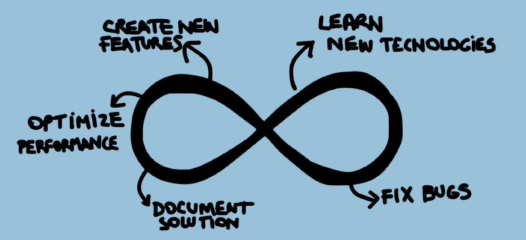
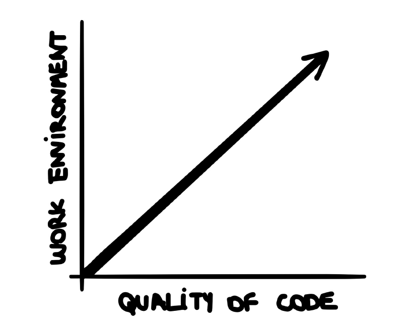
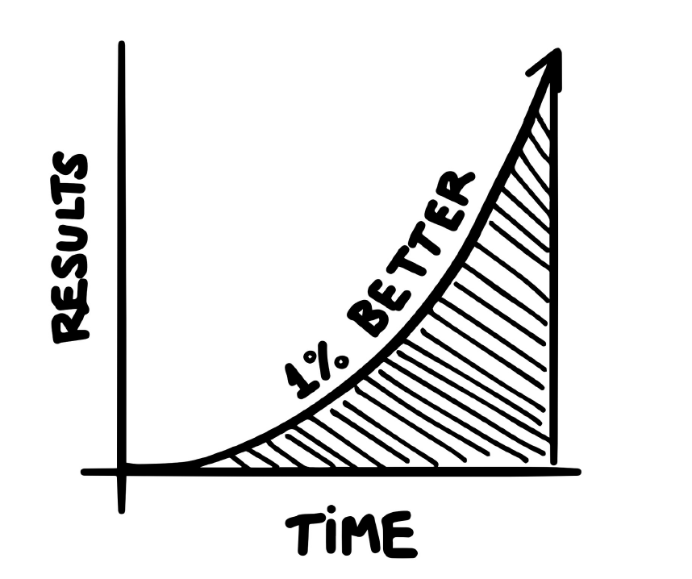
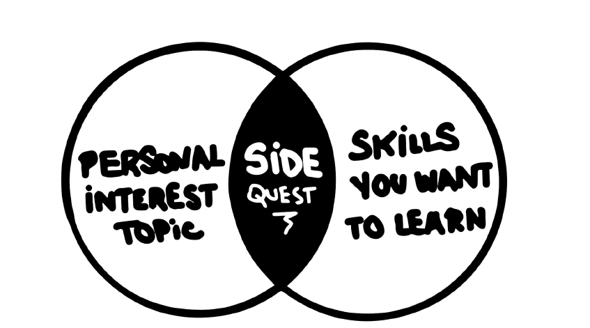

// TODO
1.  Create a list of all technologies and tools that you would
like to learn. Now label each of them with a different
priority: “This Week”, “Next Month”, “Next Year”. Whenever
you feel like you’re missing out on some new shiny trend,
revisit this list and reorganize the priority.

2.  Spend some time researching what the fundamental concepts
in your field are. Grab a piece of paper and divide it
into two columns. On the left side, list all the knowledge
that you already have. On the right side, list all the
knowledge that you still need to acquire. Plan a dedicated
time of your day to study those concepts

3.  Find an event online and submit a presentation. Open a
screen share software and record yourself doing something.
Create a blog and share an article. Choose any topic that
you want to learn and try to teach it instead.

4. Are you playing a finite or infinite game? How much time
do you spend going after short-term gains vs. investing
time in long-term outcomes?

5. Open a current project that you’re working on. Is there
any refactoring you could do to make the life of your
future self easier?

"no new code without unit tests"

What I’m trying to say is this:
*   You can watch Netflix and still be productive.
*  You can play your PlayStation and still work on an open source project.
*  You can enjoy quality time with your husband/wife and still read a
book.
* Don’t let people think you can’t relax and get stuff done. You have more than enough time.

6. Think about the skills you think could be improved. Can
you plan some extra time to develop them? Even 10 minutes
a day could make a difference

7. Elaborate a list of the most common terms used in your
industry. Start a conversation with your colleagues to
understand their areas. What does the sales funnel look
like? What marketing niches are being targeted? What are
the most common questions for customer support? How is
your product different from those of competitors?

`“Failure and invention are inseparable twins. To invent you have to
experiment, and if you know in advance that it’s going to work, it’s not an
experiment.” ― Scott Galloway"`

8. For the next few days pay attention to the apps you use
the most. Is there anything missing from them? Would you
be able to create a better version of that? Have a
dedicated notebook for all of your side project ideas and
take it everywhere with you. When you’re ready, pick one
of those ideas and give it a try.

9. Think about the three things you love the most about your
current job. Now think about the three things you hate the
most about your current job. Is there anything you can do
to turn those bad parts into good parts? Are these changes
outside of your control or not?

10. At your next meeting, choose to practice your listening
skills. Instead of being the first to say something, wait
until everybody shared their ideas, and be the last one to
speak. This will give everybody else the feeling of being
heard, plus you have the benefit of listening to
everyone’s ideas before sharing your own opinions.

* Separating large tasks into smaller ones improves the accuracy of
estimates. Decompose estimates into tasks that will require no more than
2 days of effort.
* Estimate in ranges: worst case, most likely case, best case for a task.
* For first-time development with a new language/tool compare with
development using a familiar language/tool, allow for a 20% to 40%
increase in effort.
* Document and communicate the assumptions embedded in your
estimate.
* The best estimation techniques for small projects tend to be “bottom-up”
based on estimates created by people who will actually do the work.

11. Next time someone asks for an estimate, grab a Post-it and
take a note of your answer. When you are ready to begin
the task, start a clock and see how long it takes to
complete. Once the task is done, take a note of how many
hours it actually took to finish. Repeat the same thing
for the next task.

12. Examine your work day. Examine your work week. What are
the parts that drive you the most? What type of work would
you rather do? Examine your company. Examine your team.
What are they struggling the most? Is there anything you
can help with?

https://www.tutflix.org/resources/competitive-programming-algorithms-patterns-techniques.81/

https://www.kaggle.com/thedrcat/commonlit-readability-feature-importances/

https://blog.ceshine.net/post/fastcore-patch-to-case-study/

https://www.kaggle.com/twhitehurst3/fastai-v1-waste-classification/data

Pre screening questions:
1. A side project means you will need to give up personal hours to work on
the project, so the most important thing to ask yourself is: “Do I really
enjoy this subject, field, type of work?” 
    * If the answer is “no”, then the chances are you won’t have the energy to spend extra hours working on it.
1. It takes time for a side project to gain traction, so the next thing you
should ask yourself is: “Am I willing to spend at least 5 years working
on this idea?”
    * If the answer is “no”, it’s very likely that you’ll lose motivation and will end up giving up this project before it takes off. However, if your goal is just to experiment, then you don’t need to worry about this.
3. Having an idea is one thing, having the ability to execute that idea is
completely different, so you should ask yourself: “Can I execute this
idea fully by myself?”
    * If the answer is “no”, you might consider learning a new skill or inviting a friend to fill the gaps.
4. Saying “yes” to one idea, means saying “no” to a bunch of other ideas,
so ask yourself: “Is this particular idea better than others I had in the
past? Is there any other idea that could better use my time?”
    * If the answer is “no”, then repeat this cycle with the other idea.
5. Understanding who are you building this solution for is vital. If you
don’t know your audience, it’s highly unlikely that you will understand
their needs, so ask yourself: “Do I personally experience this problem
or am I solving it for someone else?”
    * If the answer is “no”, then considering reaching out to people who actually experience the pain that you’re trying to solve. You might be surprised by what they have to say.
6. And the last question is: “Why am I excited about this idea now?”
It’s crucial to understand your underlying motivation. Do you want to learn a new technology? Do you want to make more money? Do you need a
distraction from other problems? Be honest with yourself.
    * More important than choosing your idea is choosing the scope of your
project. More often than not, many side projects won’t see the light of the
day.